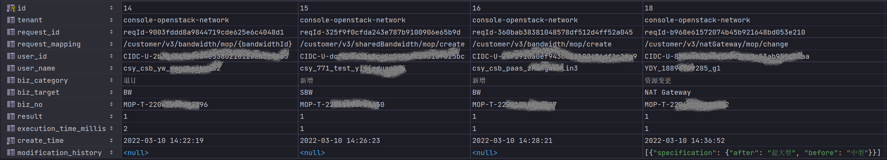

> 若在使用过程中有任何疑问，请搜索微信公众号：*程序猿杜小头*，与我联系！！！

## 如何使用
本组件已经发布到 maven 中央仓库，大家可以体验一下。GAV信息如下：
```xml
<dependency>
	<groupId>io.github.dk900912</groupId>
	<artifactId>oplog-spring-boot-starter</artifactId>
	<version>1.3</version>
</dependency>
```
#### 声明式风格
```java
@RestController
@RequestMapping(path = "/demo/v1")
public class DemoController {
    private OperationLogDao operationLogDao;

    public DemoController(OperationLogDao operationLogDao) {
        this.operationLogDao = operationLogDao;
    }

    @OperationLog(bizCategory = BizCategory.CREATE, bizTarget = "订单", bizNo = "#appResult.data.orderId")
    @PostMapping(path = "/create")
    public AppResult create(@RequestBody OrderReq orderReq) {
        // 创建资源时，一般前端不会将ID传过来，所以一般都是从响应结果中获取bizNo哈
        orderReq.setOrderId("001");
        return AppResult.success().data(orderReq);
    }

    @OperationLog(bizCategory = BizCategory.UPDATE, bizTarget = "订单", bizNo = "#orderReq.orderId")
    @PutMapping(path = "/update")
    public AppResult update(@RequestBody OrderReq orderReq) {
        return AppResult.success();
    }

    @OperationLog(bizCategory = BizCategory.DELETE, bizTarget = "订单", bizNo = "#id")
    @DeleteMapping(path = "/delete/{id}")
    public AppResult delete(@PathVariable("id") int id) {
        return AppResult.success();
    }
}
```
#### 编程式风格
```java
operationLogRemplate.execute(
        new SimpleOperationLogCallback<String, Throwable>(BizCategory.PLACE_ORDER, "订单", "order-123456") {
            @Override
            public String doBizAction() {
                // business action
            }
        });
```
> 如果业务方法A调用了业务方法B，且A和B这俩方法都由@OperationLog标记，那么B方法中并不会记录操作日志，这是Spring AOP的老问题了，官方也提供了解决方法，比如使用`AopContext.currentProxy()`。
## 如何屏蔽
一旦引入起步依赖组件，那么将自动开启日志记录功能。除了移除依赖包之外，还可以在`application.properties`中追加以下配置来实现屏蔽目的：
```
spring.oplog.enabled=false
```
## 样例

